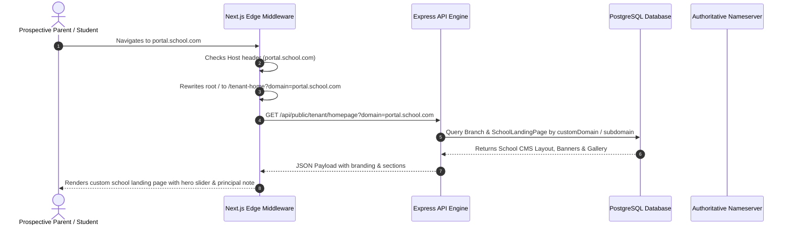

# Ugbekun 2.0: Multi-Tenant Custom Domain & Front-CMS Architecture Guide

## 1. Executive Summary

Ugbekun 2.0 provides an enterprise-grade **Multi-Tenant Custom Domain & White-Label Front-CMS Engine**. This enables every school client on the platform to:
1. **Host on Dedicated Platform Subdomains**: Zero-config instant URLs (e.g. `https://uiss.ugbekun.edu.ng`).
2. **Connect Custom Vanity Domains**: Self-branded school web addresses (e.g. `https://portal.greenwoodacademy.com`, `https://sms.leadinglight.edu.ng`) with automated DNS verification and TLS/SSL certificate issuance.
3. **Build Dynamic Landing Pages (Front-CMS Studio)**: Customize hero image carousels, executive principal welcome letters & photos, campus photo galleries, academic curricula, notices, brand palettes, and social media channels without writing code.
4. **Context-Aware Dynamic Edge Ingress**: Next.js Edge Middleware dynamically resolves the incoming `Host` header and serves the school's personalized homepage at `/` while retaining platform access at apex domains (`ugbekun.edu.ng`).

---

## 2. Architecture & Data Flow



---

## 3. Database Schema

Stored in `prisma/schema.prisma`:

```prisma
model Branch {
  id                      Int                @id @default(autoincrement())
  name                    String
  code                    String             @unique
  subdomain               String?            @unique
  customDomain            String?            @unique
  domainStatus            String             @default("ACTIVE") // ACTIVE, PENDING_VERIFICATION, MISCONFIGURED
  domainVerificationToken String?
  domainDnsTarget         String?            @default("cname.ugbekun.edu.ng")
  sslStatus               String?            @default("PROVISIONED")
  domainVerifiedAt        DateTime?
  landingPage             SchoolLandingPage?
}

model SchoolLandingPage {
  id                 Int      @id @default(autoincrement())
  branchId           Int      @unique
  branch             Branch   @relation(fields: [branchId], references: [id], onDelete: Cascade)
  isEnabled          Boolean  @default(true)
  heroHeadline       String   @default("Excellence in Holistic Education & Leadership")
  heroSubheadline    String   @default("Nurturing intellect, character, and innovation.")
  heroBanners        Json     @default("[]")
  welcomeTitle       String   @default("Welcome to Our School")
  welcomeMessage     String   @default("We welcome you to our community...")
  welcomeAuthor      String   @default("Principal / Head of School")
  welcomePhoto       String?
  aboutText          String   @default("Our school provides world-class education...")
  photoGallery       Json     @default("[]")
  academicPrograms   Json     @default("[]")
  announcements      Json     @default("[]")
  primaryColor       String   @default("#003da5")
  secondaryColor     String   @default("#009ca6")
  showAdmissionCta   Boolean  @default(true)
  showPortalLoginCta Boolean  @default(true)
  showGallery        Boolean  @default(true)
  showAnnouncements  Boolean  @default(true)
  socials            Json?    @default("{}")
}
```

---

## 4. DNS Configuration Instructions for School IT Admins

When a school configures a custom vanity domain (e.g. `portal.greenwoodacademy.com`), they must configure two DNS records in their registrar (GoDaddy, Namecheap, Cloudflare, Whogohost):

| Record Type | Host / Name | Target / Value | Purpose |
| :--- | :--- | :--- | :--- |
| **CNAME** | `portal` (or subdomain) | `cname.ugbekun.edu.ng` | Directs web traffic to Ugbekun Ingress |
| **TXT** | `_ugbekun-challenge` | `ugbekun-verify-<branchId>-<token>` | Cryptographic ownership challenge |

---

## 5. Production Edge Ingress Setups

### Option A: Cloudflare for SaaS (Recommended for Global High-Scale)
- Set Ugbekun apex `ugbekun.edu.ng` as the Custom Hostname Fallback Origin.
- Enable Cloudflare Custom Hostnames API with automated TLS.
- When an admin saves a custom domain in Ugbekun, invoke Cloudflare's `/custom_hostnames` API.

### Option B: Caddy Reverse Proxy (Zero-Config Automatic Let's Encrypt TLS)
Caddy supports `on_demand_tls` which asks the backend whether a domain is authorized before issuing certificates:

```caddyfile
{
    on_demand_tls {
        ask http://127.0.0.1:5001/api/public/tenant/resolve-domain
    }
}

:443 {
    tls {
        on_demand
    }
    reverse_proxy 127.0.0.1:3000
}
```

---

## 6. Front-CMS Visual Builder Capabilities

Superadmins and Branch Admins can access the visual Front-CMS studio:
- **Hero Banners & Carousel Slides**: Configure multiple full-width banner slides with image URL, slide title, description, and custom CTA button text & links.
- **Principal / Proprietor Welcome Address**: Principal photograph, name, title, formal letter, and school history.
- **Campus Photo Gallery**: Upload and categorize facility photos (Laboratories, Campus, Sports, Arts, Library) with interactive lightbox viewer.
- **Academic Programs Matrix**: Configure learning stages (Early Years / Montessori, Basic Primary, Junior Secondary, Senior Secondary).
- **Announcements Noticeboard**: Live events, term calendar notices, and admission alerts.
- **Brand Palette Customizer**: White-label color customization with real-time responsive preview (Desktop & Mobile device frames).
